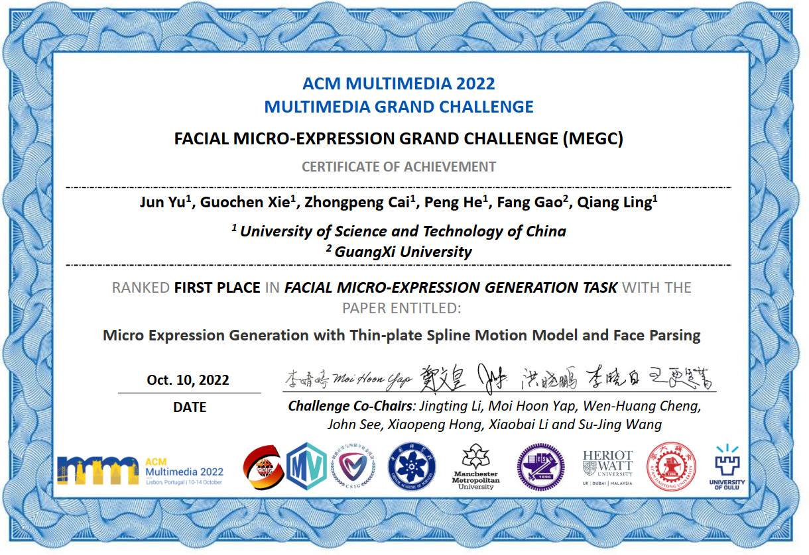
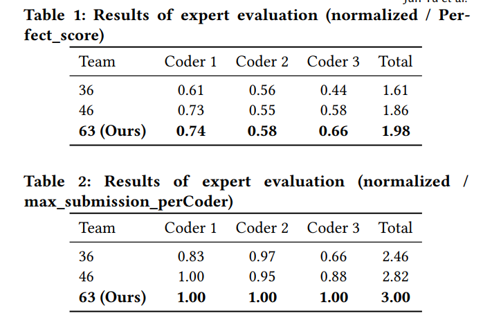

# Micro Expression Generation with Thin-plate Spline Motion Model and Face Parsing

<div align="center">



</div>

This repository is an **MindSpore** implementation of the paper [Micro Expression Generation with Thin-plate Spline Motion Model and Face Parsing](https://dl.acm.org/doi/abs/10.1145/3503161.3551609), published in ACM MM2022. 

### Installation

We support ```python3```.(Recommended version is Python 3.9).
To install the dependencies run:

```bash

pip install -r requirements.txt
```

### YAML configs

In our method, all the configurations are contained in the file ```config/Mixed_data-10-8-wMaskWarp-aug.yaml```. 

## Datasets

1. Download three datasets [CASME II](http://fu.psych.ac.cn/CASME/casme2-en.php), [SMIC](https://www.oulu.fi/cmvs/node/41319),  [SAMM](http://www2.docm.mmu.ac.uk/STAFF/M.Yap/dataset.php)  

2. Download the test dataset `megc2022-synthesis` 

3. Download the `shape_predictor_68_face_landmarks.dat` and put  it  in the `dataset`folder

4. Put the three training set and one test set in the `dataset`folder. The file tree is shown as follows:

```
.
├── CASMEII
│   ├── CASME2-coding-20190701.xlsx
│   ├── CASME2_RAW_selected
├── copy_.py
├── crop.py
├── megc2022-synthesis
│   ├── source_samples
│   ├── target_template_face
├── SAMM
│   ├── SAMM
│   ├── SAMM_Micro_FACS_Codes_v2.xlsx
├── shape_predictor_68_face_landmarks.dat
└── SMIC
    ├── SMIC_all_raw


```

5.  Run the following code
   
   ```
   cd dataset
   python crop.py
   python copy_.py
   mv Mixed_dataset_test.csv ./Mixed_dataset
   cd ..
   ```
   
   the root of the preprocessed dataset is `./dataset/Mixed_dataset`

6. Download the [train_mask.tar.gz](https://drive.google.com/file/d/1nv5auh3hYdQK9OiiUH_8ts7LnF7a0bLW/view?usp=sharing) and unzip it, then put it in the `./dataset/Mixed_dataset/train_mask`

## Training

To train a model on specific dataset run:

```
CUDA_VISIBLE_DEVICES=0,1,2,3 python run.py \
        --config config/Mixed_data-10-8-wMaskWarp-aug.yaml \
        --device_ids 0,1,2,3
```

A log folder named after the timestamp will be created. Checkpoints, loss values, reconstruction results will be saved to this folder.

## Micro expression generation

```
CUDA_VISIBLE_DEVICES=0 python demo.py \
    --config config/Mixed_data-10-8-wMaskWarp-aug.yaml  \
    --checkpoint 'path to the checkpoint' \
    --result_video './ckpt/relative' \
    --mode 'relative'
```
Our provided model can be downloaded [here](https://drive.google.com/file/d/1zdN-mPwWANMUnPQCv1Ho41JlsRtl4iqv/view?usp=sharing)
The final results are in the folder `./ckpt/relative` .

# Results
We compare our method with the proposed methods of all other competitors in MEGC2022. After expert evaluation,
our team (USTC-IAT-United) outperforms all other competitors and
win the first prize, which verifies the effectiveness of our method
(See Tab. 1, Tab.2).
<div align="center">



</div>

# Citation

Yu J, Xie G, Cai Z, et al. Micro Expression Generation with Thin-plate Spline Motion Model and Face Parsing[C]//Proceedings of the 30th ACM International Conference on Multimedia. 2022: 7210-7214.

# Acknowledgments

The main code is based upon [FOMM](https://github.com/AliaksandrSiarohin/first-order-model), [MRAA](https://github.com/snap-research/articulated-animation) and [TPS](https://github.com/yoyo-nb/Thin-Plate-Spline-Motion-Model) 

Thanks for the excellent works!
